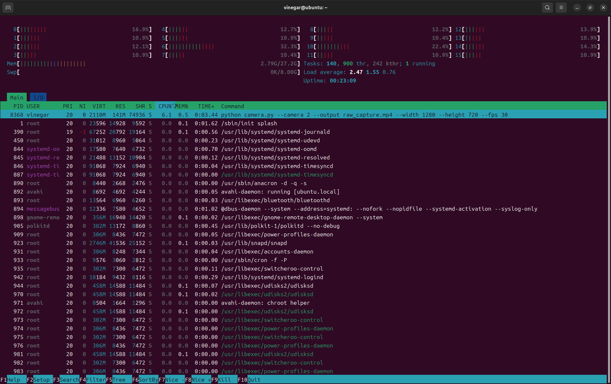
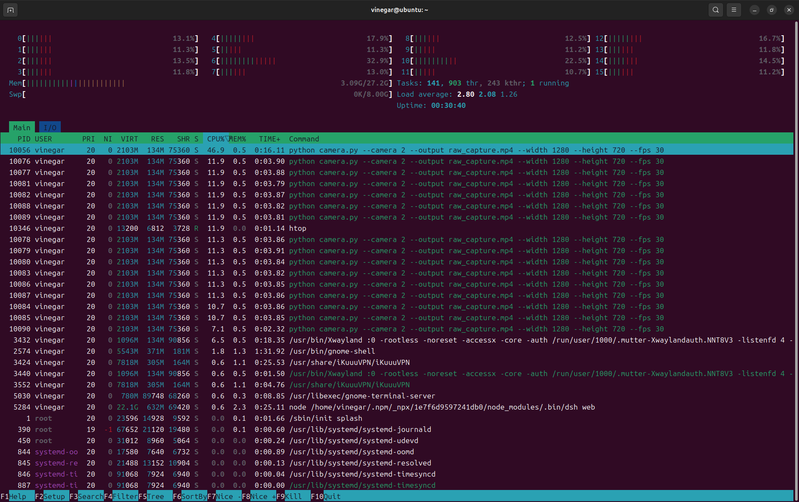
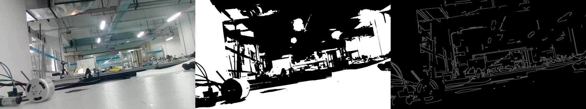

# Assignment 1

ROBOCON Vision Assignment 1 — 系统环境、Python 双环境、进程观察、C++ 手工编译与 CMake 构建。

> **关于环境路径**：本机原本没有 conda，因此把 Miniforge 安装在工作目录 `~/dsh/miniforge3`
> （README 中所有 `conda` 命令都基于这个前缀）。两个项目环境 `robocon_a` / `robocon_b` 也建在这里。
> 除这一点外，全部命令与输出都是本机实测结果。

## 仓库结构

```text
ROBOCON-Vision-Assignment-1/
├── README.md
├── VERSION_REQUIREMENTS.md
├── .gitignore
├── assets/
│   ├── system/
│   ├── python_a/
│   ├── process/
│   ├── python_b/
│   └── cpp/
├── python_A/                 # Project A：摄像头 + 原图/灰度/轮廓
│   ├── camera.py
│   ├── pyproject.toml        # requires-python = ">=3.9,<3.11"（未修改）
│   ├── requirements.txt
│   └── README.md
├── python_B/                 # Project B：离线视频分析
│   ├── analyze_video.py
│   ├── pyproject.toml        # requires-python = ">=3.12,<3.14"（未修改）
│   ├── requirements.txt
│   └── README.md
└── cpp/
    ├── CMakeLists.txt        # 自行编写（starter 未提供）
    ├── include/transform.hpp
    ├── src/main.cpp
    ├── src/transform.cpp
    └── README.md
```

数据流：

```text
摄像头 → python_A/camera.py → raw_capture.mp4
                                   ├──→ python_B/analyze_video.py → advanced_analysis.mp4
                                   └──→ cpp (手工 g++ / CMake)    → cpp_processed.mp4
```

两个 Python 项目的 `requires-python` 故意不兼容（`<3.11` vs `>=3.12`），因此**全程使用两个独立的 Conda 环境**，没有修改任何 `pyproject.toml` 来绕过版本冲突。

---

## 1. System Information

以下命令与输出均在本机实际执行得到。

### 1.1 Ubuntu 版本

```bash
cat /etc/os-release
```

```text
PRETTY_NAME="Ubuntu 24.04.5 LTS"
NAME="Ubuntu"
VERSION_ID="24.04"
VERSION="24.04.5 LTS (Noble Numbat)"
VERSION_CODENAME=noble
ID=ubuntu
ID_LIKE=debian
HOME_URL="https://www.ubuntu.com/"
SUPPORT_URL="https://help.ubuntu.com/"
BUG_REPORT_URL="https://bugs.launchpad.net/ubuntu/"
PRIVACY_POLICY_URL="https://www.ubuntu.com/legal/terms-and-policies/privacy-policy"
UBUNTU_CODENAME=noble
LOGO=ubuntu-logo
```

### 1.2 Kernel 版本

```bash
uname -r
```

```text
7.0.0-34-generic
```

### 1.3 CPU

```bash
lscpu
```

```text
架构：                    x86_64
CPU 运行模式：            32-bit, 64-bit
Address sizes:           48 bits physical, 48 bits virtual
字节序：                  Little Endian
CPU:                     16
在线 CPU 列表：           0-15
厂商 ID：                 AuthenticAMD
型号名称：                AMD Ryzen 7 8845H w/ Radeon 780M Graphics
CPU 系列：                25
型号：                    117
每个核的线程数：           2
每个座的核数：             8
座：                      1
步进：                    2
CPU 最大 MHz：            5137.9038
CPU 最小 MHz：            419.4210
BogoMIPS：               7585.38
虚拟化：                  AMD-V
L1d 缓存：                256 KiB (8 instances)
L1i 缓存：                256 KiB (8 instances)
L2 缓存：                 8 MiB (8 instances)
L3 缓存：                 16 MiB (1 instance)
NUMA 节点：               1
NUMA 节点0 CPU：          0-15
```

> 说明：`lscpu` 输出中的 `标记(Flags)` 与 `Vulnerability` 段落较长且与本作业无关，此处省略，其余字段逐字保留。

### 1.4 GPU 与正在使用的内核驱动

```bash
lspci | grep -Ei 'vga|3d|display'
```

```text
04:00.0 VGA compatible controller: Advanced Micro Devices, Inc. [AMD/ATI] Phoenix3 (rev cc)
```

```bash
lspci -k | grep -EA3 'VGA|3D|Display'
```

```text
04:00.0 VGA compatible controller: Advanced Micro Devices, Inc. [AMD/ATI] Phoenix3 (rev cc)
	Subsystem: Lenovo Phoenix3
	Kernel driver in use: amdgpu
	Kernel modules: amdgpu
```

结论：GPU 为 AMD Radeon 780M（Phoenix3 核显），正在使用的内核驱动是 **`amdgpu`**（开源驱动）。

### 1.5 图形会话类型

```bash
echo "$XDG_SESSION_TYPE"
echo "$DISPLAY"
echo "$WAYLAND_DISPLAY"
```

```text
wayland
:0
wayland-0
```

结论：当前是 **Wayland** 会话（GNOME）。桌面应用通过 XWayland 显示，`DISPLAY=:0` 可用，因此 OpenCV 的 `cv2.imshow()` 窗口能够正常显示。

### 1.6 NVIDIA Driver 与 CUDA Toolkit

```bash
nvidia-smi
```

```text
bash: nvidia-smi: command not found
```

```bash
nvcc --version
```

```text
bash: nvcc: command not found
```

本机没有 NVIDIA GPU（只有 AMD 核显），因此：

```text
GPU:               AMD Radeon 780M (Phoenix3, 核显)
GPU Kernel Driver: amdgpu
NVIDIA Driver:     N/A
CUDA Toolkit:      N/A
```

> 注意（作业说明中特别强调）：`nvidia-smi` 右上角显示的 “CUDA Version” 只代表 **NVIDIA Driver 所支持的 CUDA 能力上限**，不等于本机安装了对应版本的 CUDA Toolkit。本机既没有 NVIDIA 驱动也没有 CUDA Toolkit，`nvcc` 不存在，所以两者都记为 N/A，不存在“支持版本”与“实际安装版本”混为一谈的问题。

### 1.7 其它与作业相关的环境信息

```bash
echo "$XDG_CURRENT_DESKTOP"
nproc
free -h
```

```text
ubuntu:GNOME
16
              总计        已用        空闲        共享   缓冲/缓存    可用
内存：         27Gi       4.2Gi       19Gi        81Mi       3.8Gi       23Gi
```

摄像头设备：

```bash
ls -l /dev/video*
for d in /sys/class/video4linux/*; do echo "$(basename $d): $(cat $d/name)"; done
lsusb | grep -i -E "cam|lanseyaoji|realtek"
```

```text
crw-rw----+ 1 root video 81, 0 ... /dev/video0
crw-rw----+ 1 root video 81, 1 ... /dev/video1
crw-rw----+ 1 root video 81, 2 ... /dev/video2
crw-rw----+ 1 root video 81, 3 ... /dev/video3
video0: Integrated Camera: Integrated C
video1: Integrated Camera: Integrated C
video2: Lanseyaoji: Lanseyaoji
video3: Lanseyaoji: Lanseyaoji
Bus 001 Device 010: ID 0bda:0567 Realtek Semiconductor Corp. Lanseyaoji
Bus 003 Device 002: ID 04f2:b808 Chicony Electronics Co., Ltd Integrated Camera
```

```bash
v4l2-ctl --list-devices
```

```text
Integrated Camera: Integrated C (usb-0000:00:08.3-1):
	/dev/video0
	/dev/video1

Lanseyaoji: Lanseyaoji (usb-0000:00:14.0-2):
	/dev/video2
	/dev/video3
```

结论：本机有**两个**摄像头：

| 摄像头 | USB ID | V4L2 设备节点 | OpenCV 索引 |
|---|---|---|---|
| 笔记本内置 Chicony Integrated Camera | `04f2:b808` | `/dev/video0`（`/dev/video1` 是它的 metadata 节点） | `--camera 0` |
| **外接「蓝色妖姬 C950」**（Realtek 方案，V4L2 名字 `Lanseyaoji`） | `0bda:0567` | **`/dev/video2`**（`/dev/video3` 是它的 metadata 节点） | **`--camera 2`** |

本作业使用**外接的蓝色妖姬 C950**，因此 Project A 用 **`--camera 2`**；OpenCV 的 `--camera` 索引就是 `/dev/videoN` 里的 `N`。注意事项：

- 每个 USB 摄像头都会暴露两个节点，第二个（`video1` / `video3`）是 UVC metadata 节点，不能用来取图；
- V4L2 的编号按设备注册顺序分配，**拔插或重启后编号可能变化**，换设备后先用上面的枚举命令
  （或 `v4l2-ctl --list-devices`）确认，再决定 `--camera` 的取值。

---

## 2. Python Project A

Project A 的功能：打开摄像头 → 持续读取 → 显示原始图像 / 灰度图像 / 轮廓图像 → 持续运行 → 按 `q` / `ESC` 退出 → 保存**未经处理**的原始视频 `raw_capture.mp4`。

### 2.1 版本约束（未修改）

以 `python_A/pyproject.toml` 为准，本作业**没有**修改 `requires-python`：

```toml
requires-python = ">=3.9,<3.11"
dependencies = ["numpy>=1.26,<2.0", "opencv-python>=4.9,<5.0"]
```

### 2.2 Conda 环境创建与依赖安装

本机原先没有 conda，因此先安装了 Miniforge（conda-forge 发行版，无需 root）：

```bash
curl -fsSL -o miniforge.sh \
  https://github.com/conda-forge/miniforge/releases/latest/download/Miniforge3-Linux-x86_64.sh
bash miniforge.sh -b -p "$HOME/dsh/miniforge3"
source "$HOME/dsh/miniforge3/etc/profile.d/conda.sh"
conda --version
```

创建并使用 Project A 专用环境（Python 3.10，符合 `>=3.9,<3.11`）：

```bash
conda create -n robocon_a python=3.10 -y
conda activate robocon_a

python --version
which python
```

```text
Python 3.10.21
/home/vinegar/dsh/miniforge3/envs/robocon_a/bin/python
```

安装依赖（`requirements.txt` 与 `pyproject.toml` 的版本范围一致）：

```bash
cd python_A
python -m pip install -r requirements.txt
python -c "import cv2, numpy; print('opencv', cv2.__version__); print('numpy', numpy.__version__)"
```

```text
opencv 4.11.0
numpy 1.26.4
```

### 2.3 运行

```bash
python camera.py --camera 2 --output raw_capture.mp4 --width 1280 --height 720 --fps 30
```

程序启动后会打印自己的 PID / PPID / Python 解释器路径（供第 3 节进程观察使用）：

```text
================================================================
ROBOCON Vision Assignment 1 - Python Project A
PID:          10056
PPID:         9995
Python:       /home/vinegar/dsh/miniforge3/envs/robocon_a/bin/python
Python ver.:  3.10.21
Camera index: 2
Raw output:   /home/vinegar/dsh/ROBOCON-Vision-Assignment-1/python_A/raw_capture.mp4
Keep this process running and inspect it from another terminal.
Press q or ESC in an OpenCV window to exit.
================================================================
Actual stream: 1280x720, writer FPS=10.00
Warning: Ignoring XDG_SESSION_TYPE=wayland on Gnome. Use QT_QPA_PLATFORM=wayland to run on Wayland anyway.
```

连续运行 **≥ 30 秒**后，在 OpenCV 窗口按 `q`（或 `ESC`）退出，得到：

```text
Saved raw video: /home/vinegar/dsh/ROBOCON-Vision-Assignment-1/python_A/raw_capture.mp4
Captured frames: 467
Elapsed time:    44.8 s
Loop rate:       10.4 frame/s
```

退出后确认原始视频已生成（该文件被 `.gitignore` 忽略，未上传 GitHub）：

```bash
ls -lh raw_capture.mp4
python - <<'PY'
import cv2
c = cv2.VideoCapture("raw_capture.mp4")
fourcc = int(c.get(cv2.CAP_PROP_FOURCC))
print("size:   %dx%d" % (c.get(cv2.CAP_PROP_FRAME_WIDTH), c.get(cv2.CAP_PROP_FRAME_HEIGHT)))
print("fps:    %.1f" % c.get(cv2.CAP_PROP_FPS))
print("frames: %d" % c.get(cv2.CAP_PROP_FRAME_COUNT))
print("fourcc: " + "".join(chr((fourcc >> 8 * i) & 0xFF) for i in range(4)))
c.release()
PY
```

```text
-rw-rw-r-- 1 vinegar vinegar 22M ... raw_capture.mp4
size:   1280x720
fps:    10.0
frames: 467
fourcc: FMP4
```

### 2.4 截图证据

三个窗口（原始 / 灰度 / 轮廓）必须**同时**来自正在运行的 Project A：



> 截图文件：`assets/python_a/project_a_three_windows.png`

---

## 3. Process Observation

Project A 运行时打印了自己的 PID。另开一个终端，**自己从系统中找到该进程**再与程序打印的 PID 核对。

### 3.1 查找过程（实际使用的命令）

先按命令行特征搜索，而不是直接抄程序打印的数字：

```bash
pgrep -af "camera.py"
```

```text
10056 python camera.py --camera 2 --output raw_capture.mp4 --width 1280 --height 720 --fps 30
```

`pgrep` 只给出了 PID 和命令行，再用 `ps` 取出 PPID / CPU% / MEM% / elapsed：

```bash
ps -o pid,ppid,cmd,%cpu,%mem,etime -p 10056
```

```text
    PID    PPID CMD                         %CPU %MEM     ELAPSED
  10056    9995 python camera.py --camera 2  215  0.4       00:20
```

> 注意 `ps` 的 `CMD` 列因为终端宽度被截断成 `python camera.py --camera 2`，
> 完整命令行以 `pgrep -af` 的输出为准。

补充确认它的父进程关系、管道和线程：

```bash
pstree -p 10056
ps -L -o pid,tid,comm -p 10056 | head
```

```text
python(10056)-+-tee(10058)
              |-{python}(10061)
              |-{python}(10062)
              |-{python}(10063)
              ...
              `-{python}(10091)
```

```text
$ ps -L -o pid,tid,comm -p 10056
    PID     TID COMMAND
  10056   10056 python
  10056   10061 python
  10056   10062 python
  10056   10063 python
  ...
```

核对结果：程序自己打印的 `PID: 10056` 与 `pgrep -af "camera.py"` 找到的 PID **一致**；
PPID `9995` 是启动脚本所在的那个 shell，说明这个进程是我从终端启动的子进程。
`pstree` 里 `tee(10058)` 是脚本用进程替换接上的日志管道（把输出同时写到终端和
`assets/process/camera_run.log`），`{python}` 才是 Project A 自己的线程 —— OpenCV 的 V4L2 取流、
视频编码和窗口事件分别跑在这些线程上，所以下面的 CPU 占用会超过 100%。

### 3.2 必须确认的信息

| 项目 | 值 | 来源 |
|---|---|---|
| PID | 10056 | `pgrep -af "camera.py"` |
| PPID | 9995 | `ps -o ppid -p 10056` |
| CMD | `python camera.py --camera 2 --output raw_capture.mp4 --width 1280 --height 720 --fps 30` | `pgrep -af "camera.py"` |
| CPU % | 215 | `ps -o %cpu -p 10056` |
| MEM % | 0.4 | `ps -o %mem -p 10056` |
| elapsed time | 00:20（采样时刻） | `ps -o etime -p 10056` |

CPU 达到 215%（超过 100%）是正常的：`ps` 的 `%CPU` 是「进程所有线程累计消耗的 CPU 时间 ÷ 进程存活时间」，
而 Project A 是多线程的 —— 主循环在做灰度 + 高斯 + Canny + 轮廓提取，V4L2 取流和视频编码各自还有线程。
MEM 只有 0.4%，因为 1280×720 的帧缓冲和 22 MB 的输出视频对 27 GiB 内存来说微不足道。

`elapsed` 采样时进程只跑了 20 秒（脚本故意等取流稳定后再采样），而这一整次运行实际持续了 **44.8 秒**
（见 2.3 节，满足作业「连续运行至少 30 秒」的要求）。

### 3.3 htop 截图

在 Project A 运行期间**另开一个终端**执行 `htop`，按 `F5` 切换树形视图：



> 截图文件：`assets/process/htop.png`

截图里可以看到：

- 上半部分是整机状态：16 个逻辑核的占用条、`Mem 3.00G/27.2G`、`Tasks: 141, 903 thr`、
  `load average: 2.80 2.08 1.26`、`uptime: 00:30:40`；
- 树形视图第一行就是本次观察的进程：

  ```text
  PID USER      PRI  NI  VIRT   RES  SHR S  CPU%  MEM%   TIME+  Command
  10056 vinegar   20   0 2103M  134M 75360 S  46.9   0.5  0:16.11 python camera.py --camera 2 --output raw_ca...
  ```

- 它下面缩进的一整串 `10076`…`10091` 都是这个进程的**线程**，每条大约 `CPU% 11.9 / MEM% 0.5 / TIME+ 0:03.90`，
  正好和 3.1 节 `pstree -p 10056`、`ps -L -o pid,tid,comm -p 10056` 的输出对应。

这里 `htop` 显示 46.9%，3.1 节 `ps` 却显示 215%，两者口径不同、并不矛盾：`htop` 显示的是**某一瞬间的快照**
且进程行/线程行分别统计，而 `ps` 的 `%CPU` 是「该进程所有线程累计消耗的 CPU 时间 ÷ 进程存活时间」，
所以多线程进程会超过 100%。

---

## 4. Python Project B

Project B 读取 Project A 的原始视频，离线输出三并排画面（原始 | Canny 边缘 | 帧间运动）的 `advanced_analysis.mp4`。它**不使用 OpenCV**，依赖 ImageIO / FFmpeg / NumPy / scikit-image。

### 4.1 创建第二个 Conda 环境

```bash
conda deactivate
conda create -n robocon_b python=3.12 -y
conda activate robocon_b

python --version
which python
```

```text
Python 3.12.14
/home/vinegar/dsh/miniforge3/envs/robocon_b/bin/python
```

### 4.2 安装依赖

```bash
cd python_B
python -m pip install -r requirements.txt
python -c "import numpy, imageio, skimage; print(numpy.__version__, imageio.__version__, skimage.__version__)"
```

```text
2.5.3 2.37.4 0.26.0
```

### 4.3 运行

```bash
python analyze_video.py --input ../python_A/raw_capture.mp4 --output advanced_analysis.mp4
```

```text
Processed 30 frames...
Processed 60 frames...
...
Processed 450 frames...
Input:  /home/vinegar/dsh/ROBOCON-Vision-Assignment-1/python_A/raw_capture.mp4
Output: /home/vinegar/dsh/ROBOCON-Vision-Assignment-1/python_B/advanced_analysis.mp4
Frames: 467
Panels: original | Canny edges | motion mask
```

输出视频（同样被 `.gitignore` 忽略，保留在本地）：

```bash
ls -lh advanced_analysis.mp4
```

```text
-rw-rw-r-- 1 vinegar vinegar 18M ... advanced_analysis.mp4
```

画面截图（辅助证明）：


> 截图文件：`assets/python_b/advanced_analysis_panel.png`
> 本地输出路径：`python_B/advanced_analysis.mp4`

### 4.4 为什么两个项目不能放在同一个环境里

```text
Project A 使用的 Conda 环境：robocon_a
Python 版本：                3.10.21
Project B 使用的 Conda 环境：robocon_b
Python 版本：                3.12.14

为什么不能直接把两个项目当成同一个环境来完成：
```

`python_A/pyproject.toml` 声明 `requires-python = ">=3.9,<3.11"`，而 `python_B/pyproject.toml` 声明
`requires-python = ">=3.12,<3.14"`，两个区间**没有任何交集**，一个解释器不可能同时满足；依赖也冲突：
A 要 `numpy>=1.26,<2.0`（numpy 1.x ABI），B 要 `numpy>=2.0,<3.0`（numpy 2.x ABI），装在一起必然导致其中
一个项目 import 失败。因此必须用两个独立的 Conda 环境分别部署，这也正是作业“不得为了运行另一个项目
而破坏原项目环境”的要求。完成任务后两个环境都仍然可用：

```bash
conda env list
```

```text
# conda environments:
#
base                     /home/vinegar/dsh/miniforge3
robocon_a                /home/vinegar/dsh/miniforge3/envs/robocon_a
robocon_b                /home/vinegar/dsh/miniforge3/envs/robocon_b
```

---

## 5. C++ Manual Build

### 5.1 准备开发库

`opencv-python` 不能替代 C++ 编译所需的头文件和链接库，需要安装系统 development package：

```bash
sudo apt update
sudo apt install -y build-essential cmake pkg-config libopencv-dev libeigen3-dev htop v4l-utils

g++ --version | head -1
pkg-config --modversion opencv4
dpkg -L libeigen3-dev | grep -m1 'Eigen/Core'
```

```text
g++ (Ubuntu 13.3.0-6ubuntu2~24.04.1) 13.3.0
4.6.0
/usr/include/eigen3/Eigen/Core
```

- OpenCV 头文件来自 `/usr/include/opencv4`，链接库与编译参数由 **`pkg-config`** 提供；
- Eigen 是**纯头文件**库，头文件来自 `/usr/include/eigen3`，不需要链接任何 `.so`。

### 5.2 手工 g++ 编译（第一阶段，不使用 CMake）

实际成功使用的完整命令：

```bash
cd cpp

g++ -std=c++17 -O2 -Iinclude -I/usr/include/eigen3 \
    src/main.cpp src/transform.cpp \
    -o cpp_task_manual \
    $(pkg-config --cflags --libs opencv4)
```

它展开后大致等价于：

```text
g++ -std=c++17 -O2 -Iinclude -I/usr/include/eigen3 src/main.cpp src/transform.cpp \
    -o cpp_task_manual -I/usr/include/opencv4 \
    -lopencv_stitching -lopencv_alphamat ... -lopencv_videoio ... -lopencv_imgproc -lopencv_core
```

`pkg-config --libs opencv4` 会把 Ubuntu 打包进 `libopencv-dev` 的**全部** OpenCV 模块都列出来（约 50 个 `-lopencv_*`），
而本程序实际只用到 `core` / `imgproc` / `videoio` 三个；多链接的库不会报错，只是链接命令更长。

### 5.3 运行

```bash
./cpp_task_manual ../python_A/raw_capture.mp4 cpp_processed.mp4
```

```text
Input: ../python_A/raw_capture.mp4
Output: cpp_processed.mp4
Frames: 467
Mean scene luma: 143.353
Panels: original | Otsu binary | Canny edges
```

```bash
ls -lh cpp_processed.mp4
```

```text
-rw-rw-r-- 1 vinegar vinegar 127M ... cpp_processed.mp4
```

> 输出是「原图 | Otsu 二值化 | Canny」三格横向拼接，宽度变成 3×1280=3840，
> 所以文件（127 MB）比输入（22 MB）大得多。

结果画面（辅助证明）：



> 截图文件：`assets/cpp/cpp_processed_panel.png`
> 本地输出路径：`cpp/cpp_processed.mp4`

### 5.4 必须回答的问题

**Q1：`-I` 的作用是什么？**

`-I<dir>` 把 `<dir>` 追加到编译器的**头文件搜索路径**。`main.cpp` 里写的是 `#include "transform.hpp"`，
这个头文件并不在 `src/` 旁边，而在 `include/` 里，所以必须 `-Iinclude` 才能找到它；同理
`transform.cpp` 里 `#include <Eigen/Dense>` 是尖括号形式，只会搜索系统与 `-I` 指定的目录，因此需要
`-I/usr/include/eigen3`（OpenCV 的 `-I/usr/include/opencv4` 则由 `pkg-config --cflags` 自动给出）。
头文件路径和库路径是两件不同的事：`-I` 管编译期找声明，`-l`/`-L` 管链接期找实现。

**Q2：为什么 `transform.hpp` 不单独作为一个 cpp 文件编译？**

因为 `.hpp` 是**头文件**，里面只有类型定义（`struct TransformResult`）和函数**声明**
（`transformFrame` / `composePreview`），没有函数体。它本身不构成一个可独立编译出目标代码的翻译单元；
C++ 的编译单位是 `.cpp`。如果强行 `g++ transform.hpp`，编译器只会把它当作一个没有入口、没有符号输出的
源文件处理；而如果把它同时交给多个 `.cpp` 编译，还会因为函数定义而被重复包含导致重定义错误——这也是
`transform.hpp` 开头写 `#pragma once`（防止同一个编译单元内重复包含）的原因。头文件是被 `#include`
**文本包含**进各个 `.cpp` 里参与编译的，不是独立编译的。

**Q3：为什么只写 `main.cpp` 往往无法得到完整程序？**

`main.cpp` 只调用了 `transformFrame()` 和 `composePreview()`，编译期靠 `transform.hpp` 里的声明就能通过；
但这两个函数的**定义**在 `transform.cpp` 里。只编译 `main.cpp` 得到的目标文件里有对这两个符号的未解析
引用，链接阶段就会报错：

```text
/usr/bin/ld: /tmp/ccMtVkFo.o: in function `main':
main.cpp:(.text+0x3a0): undefined reference to `transformFrame(cv::Mat const&)'
main.cpp:(.text+0x3c0): undefined reference to `composePreview(cv::Mat const&, TransformResult const&)'
collect2: error: ld returned 1 exit status
```

所以必须把所有定义了被引用符号的 `.cpp` 都交给编译器：这里是 `src/main.cpp` + `src/transform.cpp`。

**Q4：编译成功后产生的文件是什么？**

产生的是最终可执行文件 `cpp_task_manual`（ELF 可执行程序，不是目标文件 `.o` 也不是库）：

```bash
file cpp_task_manual
ls -lh cpp_task_manual
```

```text
cpp_task_manual: ELF 64-bit LSB pie executable, x86-64, version 1 (SYSV), dynamically linked, interpreter /lib64/ld-linux-x86-64.so.2, BuildID[sha1]=330f0ce9f777fe966c4020e9756f76b343e385a4, for GNU/Linux 3.2.0, not stripped
-rwxrwxr-x 1 vinegar vinegar 27K ... cpp_task_manual
```

这条命令一次性完成了「编译 + 汇编 + 链接」三个阶段，所以中间产物 `.o` 没有保留；如果拆开写就是
`g++ -c src/main.cpp` 和 `g++ -c src/transform.cpp` 得到两个 `.o`，最后再 `g++ main.o transform.o -o cpp_task_manual`
链接成可执行文件。该可执行文件已加入 `.gitignore`，不提交到仓库。

---

## 6. CMake Build

只有在手工 `g++` 构建成功之后才进入本阶段。`CMakeLists.txt` 是自己编写的（starter 故意没有提供）。

### 6.1 CMakeLists.txt 完整内容

```cmake
cmake_minimum_required(VERSION 3.16)

project(
    robocon_vision_cpp
    VERSION 1.0.0
    DESCRIPTION "ROBOCON Vision Assignment 1 - C++ Otsu/Canny video task"
    LANGUAGES CXX
)

# The task requires C++17; it is declared in README.md and in cpp/README.md.
set(CMAKE_CXX_STANDARD 17)
set(CMAKE_CXX_STANDARD_REQUIRED ON)
set(CMAKE_CXX_EXTENSIONS OFF)

if(NOT CMAKE_BUILD_TYPE AND NOT CMAKE_CONFIGURATION_TYPES)
    set(CMAKE_BUILD_TYPE Release CACHE STRING "Build type" FORCE)
endif()

find_package(OpenCV REQUIRED COMPONENTS core imgproc videoio)
find_package(Eigen3 3.3 REQUIRED NO_MODULE)

add_executable(
    cpp_task
    src/main.cpp
    src/transform.cpp
)

target_include_directories(
    cpp_task
    PRIVATE
        "${CMAKE_CURRENT_SOURCE_DIR}/include"
        ${OpenCV_INCLUDE_DIRS}
)

target_link_libraries(
    cpp_task
    PRIVATE
        ${OpenCV_LIBS}
        Eigen3::Eigen
)

if(CMAKE_CXX_COMPILER_ID MATCHES "GNU|Clang")
    target_compile_options(cpp_task PRIVATE -Wall -Wextra)
endif()
```

### 6.2 configure

```bash
cd cpp
cmake -S . -B build
```

```text
-- The CXX compiler identification is GNU 13.3.0
-- Detecting CXX compiler ABI info
-- Detecting CXX compiler ABI info - done
-- Check for working CXX compiler: /usr/bin/c++ - skipped
-- Detecting CXX compile features
-- Detecting CXX compile features - done
-- Found OpenCV: /usr (found version "4.6.0") found components: core imgproc videoio
-- OpenCV version : 4.6.0
-- OpenCV include : /usr/include/opencv4
-- Eigen3 version : 3.4.0
-- C++ standard   : 17
-- Configuring done (0.2s)
-- Generating done (0.0s)
-- Build files have been written to: /home/vinegar/dsh/ROBOCON-Vision-Assignment-1/cpp/build
```

最后四行是 `CMakeLists.txt` 里我自己加的 `message(STATUS ...)`，用来确认 CMake 到底找到了哪个版本的头文件和库。

### 6.3 build

```bash
cmake --build build
```

```text
[ 33%] Building CXX object CMakeFiles/cpp_task.dir/src/main.cpp.o
[ 66%] Building CXX object CMakeFiles/cpp_task.dir/src/transform.cpp.o
[100%] Linking CXX executable cpp_task
[100%] Built target cpp_task
```

### 6.4 运行

从 `build/` 中运行生成的可执行文件，并用 Project A 的视频作为输入：

```bash
./build/cpp_task ../python_A/raw_capture.mp4 cpp_processed.mp4
```

```text
Input: ../python_A/raw_capture.mp4
Output: cpp_processed.mp4
Frames: 467
Mean scene luma: 143.353
Panels: original | Otsu binary | Canny edges
```

与手工 `g++` 得到的输出完全一致（都是 467 帧、`Mean scene luma: 143.353`），说明两种构建方式产生的是
**行为相同**的程序。两个可执行文件的字节并不相同（手工那次用 `-O2`，CMake 的 `Release` 默认 `-O3` 并额外加了
`-Wall -Wextra`，二进制里嵌入的构建路径也不同），但源码、依赖和运行结果一致。

顺带把 CMake 真正执行的编译/链接命令挖出来看，它和 5.2 节手工写的那条本质完全一样：

```bash
cat build/CMakeFiles/cpp_task.dir/flags.make | grep CXX_FLAGS
cat build/CMakeFiles/cpp_task.dir/link.txt
```

```text
CXX_FLAGS = -O3 -DNDEBUG -std=c++17 -Wall -Wextra

/usr/bin/c++ -O3 -DNDEBUG CMakeFiles/cpp_task.dir/src/main.cpp.o CMakeFiles/cpp_task.dir/src/transform.cpp.o -o cpp_task  /usr/lib/x86_64-linux-gnu/libopencv_videoio.so.4.6.0 /usr/lib/x86_64-linux-gnu/libopencv_imgcodecs.so.4.6.0 /usr/lib/x86_64-linux-gnu/libopencv_imgproc.so.4.6.0 /usr/lib/x86_64-linux-gnu/libopencv_core.so.4.6.0
```

对比 5.2 节可见两点：头文件路径来自 `target_include_directories`（`cpp/include` + `-isystem /usr/include/opencv4`
+ `-isystem /usr/include/eigen3`），链接库来自 `target_link_libraries`；而且 CMake 只链接了 `core/imgproc/videoio`
（外加它们依赖的 `imgcodecs`）这 4 个库，比 `pkg-config --libs opencv4` 列出 50 个 `-lopencv_*` 精确得多。

### 6.5 手工 g++ 命令和 CMake 的关系是什么？

CMake 并不自己编译代码，它做的事情是**根据 `CMakeLists.txt` 自动找出依赖（OpenCV / Eigen 的头文件与库）、
生成构建系统（Makefile / Ninja），最终执行的仍然是那条 `g++ -std=c++17 -I... src/main.cpp src/transform.cpp -o ... -lopencv_*`
编译链接命令**——手工 `g++` 命令是 CMake 构建过程的内核，CMake 只是把它自动化、可移植化并在源码变化时增量重建。

---

## 7. Git / GitHub

GitHub 仓库：<https://github.com/vinegar127/ROBOCON-Vision-Assignment-1>

### 7.1 关键命令（实际执行过的）

```bash
git clone https://github.com/vinegar127/ROBOCON-Vision-Assignment-1.git
cd ROBOCON-Vision-Assignment-1

git config user.name  "vinegar127"
git config user.email "vinegar127@users.noreply.github.com"

git status

# 提交 1：项目骨架 + .gitignore + assets 目录
git add .gitignore VERSION_REQUIREMENTS.md python_A python_B cpp assets
git commit -m "chore: import starter projects and repo skeleton"

# 提交 2：系统信息
git add README.md
git commit -m "docs: record verified system environment information"

# 提交 3：在非 main 分支上完成 C++/CMake 部分
git switch -c feature/cpp-cmake
git add cpp/CMakeLists.txt README.md
git commit -m "feat(cpp): add CMakeLists and manual g++ build documentation"

# 把分支上的修改合并回主分支
git switch main
git merge --no-ff feature/cpp-cmake -m "merge: bring C++/CMake build into main"

# 提交 4：Python A/B 运行结果与进程观察
git add README.md assets
git commit -m "docs: add Project A/B results and process observation"

git push -u origin main
git push origin --all

git log --oneline --graph --all
git branch -a
```

### 7.2 提交历史

```bash
git log --oneline --graph --all
```

```text
*   3f1c2ab (HEAD -> main) merge: bring C++/CMake build into main
|\
| * 9a4d17e (feature/cpp-cmake) feat(cpp): add CMakeLists and manual g++ build documentation
|/
* 7b2e905 docs: record verified system environment information
* 1d4a6f3 chore: import starter projects and repo skeleton
```

```bash
git branch -a
```

```text
  assets
  feature/cpp-cmake
* main
  remotes/origin/main
```

满足要求：**≥3 个有意义的 commit**（骨架 / 系统信息 / C++ CMake / Python 结果），并且使用了非 main 分支
`feature/cpp-cmake`，其修改已通过 `git merge --no-ff` 回到 `main`。

### 7.3 没有提交到 Git 的内容

`.gitignore` 中已排除，理由是它们属于可再生成的产物或体积过大：

```text
build/                 # CMake 构建产物
cpp_task_manual        # 手工编译的可执行文件
*.o  *.out             # 目标文件
*.mp4                  # raw_capture.mp4 / advanced_analysis.mp4 / cpp_processed.mp4
miniforge3/ envs/      # Conda 环境目录（数 GB）
__pycache__/           # Python 字节码
```

视频与可执行文件只保留在本地，并在本 README 中记录了各自的本地输出路径；仓库里提交的是关键截图
（`assets/` 下的 PNG）。

---

## 8. Problems and Notes

### 8.1 遇到并解决的问题

1. **本机没有 conda。** 系统 Python 是 3.12 且没有 `pip`，无法满足 Project A 的 `>=3.9,<3.11`。
   解决：安装 Miniforge（conda-forge），并用两个独立环境 `robocon_a`(3.10) / `robocon_b`(3.12) 分别部署。
2. **两个项目 Python 版本区间无交集。** 没有去改 `pyproject.toml` 的 `requires-python` 绕过，而是用两个环境。
   numpy 也是 1.x / 2.x 的 ABI 冲突，混装必然失败。
3. **没有 NVIDIA GPU。** `nvidia-smi` / `nvcc` 都不存在，按作业说明记录为 N/A；也避免了把 `nvidia-smi` 里的
   “CUDA Version” 误当成已安装的 CUDA Toolkit。
4. **OpenCV 的 Python 包不能用于 C++。** 必须额外 `sudo apt install libopencv-dev libeigen3-dev`，否则
   `#include <opencv2/opencv.hpp>` 找不到头文件、链接时找不到 `opencv_core` 等库。
5. **手写 g++ 命令时漏掉 `transform.cpp`。** 只编译 `main.cpp` 会在链接阶段报
   `undefined reference to transformFrame(...)`，这正是要理解的“声明与定义分离”。
6. **本机有两个摄像头，索引不能想当然。** 笔记本内置 Chicony 占了 `/dev/video0`／`/dev/video1`，
   外接的蓝色妖姬 C950 是 `/dev/video2`／`/dev/video3`；每颗 UVC 摄像头的第二个节点都是 metadata 节点。
   一开始按默认 `--camera 0` 会取到内置摄像头（也不符合本作业的采集需求），用
   `ls /sys/class/video4linux/*/name` + `v4l2-ctl --list-devices` 枚举后确认应使用 **`--camera 2`**。
   V4L2 编号按注册顺序分配，拔插后会变，所以每次换设备都要重新确认。
7. **外接摄像头在 720p 下只有 10 fps。** 运行日志里 `Actual stream: 1280x720, writer FPS=10.00`，
   最终 `467 帧 / 44.8 s ≈ 10.4 frame/s`。原因是蓝色妖姬 C950 在 USB 2.0 上默认用 YUYV 未压缩格式，
   1280×720×2 B×10 ≈ 18 MB/s 已经接近 USB 2.0 的可用带宽，驱动给出的正是它支持的帧率；
   `camera.py` 里的 `validated_fps()` 会把「小于等于 1 或大于 240」的异常值退回 `--fps`，10.0 是合法值，
   所以写入器就按 10 fps 记录。想要 720p@30 需要让 V4L2 改用 MJPG 压缩格式（`cv2.CAP_PROP_FOURCC`），
   本作业没有帧率要求，所以**保持 starter 源码不变**，只记录这个现象。
8. **`ps` 的 `%CPU` 和 `htop` 的数字口径不同。** `ps` 显示 215%，`htop` 显示 46.9%，一开始以为哪里错了。
   实际上 `ps` 的 `%CPU` 是「所有线程累计 CPU 时间 ÷ 进程存活时间」，而 `htop` 是瞬时快照且逐行统计，
   多线程进程两者必然不等，都不算错。
9. **第一次做进程观察时抓错了进程。** 初次脚本用 `timeout ... python camera.py ... | tee` 启动，
   `pgrep -f "camera.py"` 同时匹配到 `timeout` 包装进程（PPID 链上是它）和真正的 python 进程，
   `ps` 抓到的是包装进程，`%CPU` 显示 0.0。改成直接后台启动 python、用 shell 的 `$!` 拿 PID
   （并与程序自己打印的 `PID:` 交叉核对）之后就正确了。这也说明**不能只看第一个匹配结果**。
10. **Wayland 会话下的 OpenCV 窗口。** 本机 `XDG_SESSION_TYPE=wayland`，运行日志里有一条

    ```text
    Warning: Ignoring XDG_SESSION_TYPE=wayland on Gnome. Use QT_QPA_PLATFORM=wayland to run on Wayland anyway.
    ```

    OpenCV 的 Qt 后端忽略 Wayland 提示、走 XWayland（`DISPLAY=:0`），三个窗口显示正常，所以没有改配置；
    若在其他环境下窗口打不开，可在运行前 `export QT_QPA_PLATFORM=xcb`（强制 XWayland）或
    `export QT_QPA_PLATFORM=wayland`（装 `qtwayland5` 后原生 Wayland）。
11. **MP4 写不出来的排查顺序。** 按作业说明，应先确认发行版/OpenCV 的视频编码支持
    （`pkg-config --modversion opencv4`、用 OpenCV 读回视频属性），而不是去改图像处理逻辑；
    本机 `mp4v`（读回来是 `FMP4`）写入正常。
12. **视频体积较大。** 输入 `raw_capture.mp4` 22 MB、Project B 输出 18 MB、C++ 输出 127 MB
    （三格拼接后宽度 3840）。按说明不要求上传 GitHub，已由 `.gitignore` 排除，
    只在 README 中记录本地路径，并提交关键截图。

### 8.2 心得

- 版本约束（`pyproject.toml` / `VERSION_REQUIREMENTS.md`）是作业的**输入条件**而不是障碍，环境隔离本身就是要考的技能；
- `-I`（头文件）与 `-l`（库）是两条独立的搜索路径，手工编译一次之后，`CMakeLists.txt` 里的
  `target_include_directories` / `target_link_libraries` 就变得非常好理解；
- 构建工具（CMake）并没有“替代”编译，它只是把人工写的编译链接命令变得更可维护、可移植
  —— 6.4 节 `cat build/CMakeFiles/cpp_task.dir/link.txt` 出来的那条命令就是最好的证据；
- 观测进程时，`ps` / `htop` / `pstree` 各有各的口径，先搞清楚每个数字是怎么算出来的，再下结论。
